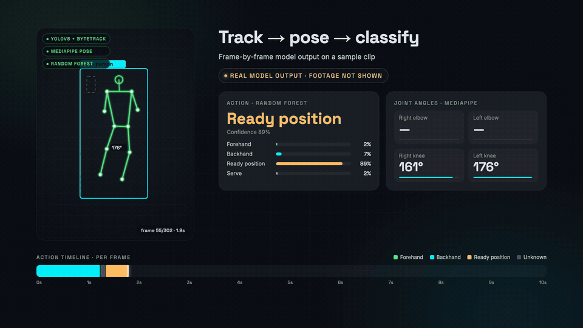

# ShadowAthlete

**Your next opponent is you.**

▶ **[Watch the full 57-second demo (MP4)](demo-video/media/shadowathlete-demo.mp4)**

---

# InnovaX

Build a polished, modern, production-style full-stack application for a hackathon called **ShadowAthlete**.

Tagline:

**“Your only opponent is you.”**

The application is an **AI-powered multi-sport athlete digital twin platform**.

The core concept is that an athlete uploads or records videos of themselves performing different sports and athletic activities. Computer vision analyzes their movement and performance, and the application creates one persistent digital avatar representing the athlete.

This avatar is not just cosmetic. It is a living digital twin whose athletic abilities, stats, strengths, weaknesses, recovery, training history, and sport-specific skills evolve over time as the real athlete improves.

The key differentiator is:

**One athlete. One avatar. Multiple sports.**

The product should NOT feel like separate applications for basketball, running, tennis, cricket, etc. Every activity contributes toward one universal athlete profile.

---

# PRODUCT VISION

The application should follow this continuous loop:

**CAPTURE → ANALYZE → BUILD DIGITAL TWIN → TRAIN → COMPETE AGAINST YOUR SHADOW → RECOVER → IMPROVE → UPDATE DIGITAL TWIN**

The athlete should feel like they are building an RPG character, except that the character represents their real-world athletic ability.

The application should combine:

- computer vision
- pose estimation
- sports analytics
- machine learning
- AI coaching
- gamification
- recovery tracking
- wearable data
- training-plan generation
- visualization
- digital avatars
- progress analytics

The UI should feel premium, futuristic, athletic, immersive, and data-driven.

Think of the experience as a combination of:

- a professional sports-performance dashboard
- a video-analysis platform
- an RPG character progression system
- an AI coach
- a wearable recovery application

Avoid making it look like a generic fitness tracker.

---

# PRIMARY SPORTS FOR THE MVP

Support at least these four activities:

1. Running
2. Basketball
3. Tennis
4. Cricket fast bowling

Architect the system so more sports can easily be added later.

Each sport should share common athlete metrics but also contain sport-specific analytics.

---

# CORE CONCEPT — THE ATHLETE DIGITAL TWIN

Every user has one primary 3D or visually rich athlete avatar.

The avatar should have an overall:

**Athlete Score**

Example:

Athlete Score: **782**

The avatar also has universal attributes:

- Speed
- Power
- Endurance
- Agility
- Coordination
- Balance
- Mobility
- Reaction
- Technique
- Recovery

Display attributes on a 0–100 scale.

Example:

Speed: 82  
Power: 76  
Endurance: 71  
Agility: 79  
Coordination: 84  
Balance: 74  
Mobility: 69  
Reaction: 81  
Recovery: 77

The avatar should visually evolve as the athlete improves.

Show:

- level
- XP
- overall athlete score
- strongest attribute
- weakest attribute
- recent improvements
- sport specialties

Example:

**LEVEL 27**

1,240 XP until Level 28

---

# DIGITAL TWIN VERSIONS

The athlete should have three versions of themselves.

## Current You

Represents their current athletic state.

## Peak You

Represents the best values they have ever achieved.

## Target You

Represents future goals and AI-generated projected performance.

Allow the user to compare these three visually.

Example:

| Metric | Current | Peak | Target |
| Pace | 4:41/km | 4:29/km | 4:15/km |
| Vertical | 61 cm | 64 cm | 70 cm |
| Serve Speed | 142 km/h | 147 km/h | 155 km/h |

---

# ONBOARDING — BUILD YOUR ATHLETE

The onboarding experience should feel exciting.

Screen title:

**BUILD YOUR ATHLETE**

Ask the user for:

- name
- age
- height
- weight
- experience level
- primary sport
- secondary sports
- goals
- weekly training availability

Then create an athletic baseline through short assessments.

Possible assessments:

### Test 1 — Running

Upload or record a running video.

### Test 2 — Jump

Record 3 vertical jumps.

### Test 3 — Sport Skill

Choose basketball, tennis, or cricket.

### Test 4 — Mobility / Movement

Perform a simple athletic movement.

After processing, show a dramatic screen:

**DIGITAL TWIN CREATED**

Then reveal their avatar and initial stats.

---

# VIDEO ANALYSIS

Users should be able to:

- upload a video
- record from their device camera
- select the sport/activity
- process the video
- view analyzed footage

Computer vision should detect body landmarks and movement.

Possible technologies:

- MediaPipe Pose
- MoveNet
- OpenCV
- YOLO
- custom ML models

Draw skeleton overlays on the athlete.

Provide:

- joint tracking
- movement paths
- angles
- velocity estimates
- repetitions/events
- body alignment
- sport-specific metrics

For the hackathon, realistic simulated metrics are acceptable where measurement cannot reliably be calculated from a normal video, but the architecture should clearly support real models later.

---

# RUNNING ANALYTICS

Track:

- pace
- estimated speed
- cadence
- stride length
- stride consistency
- knee drive
- body lean
- hip movement
- foot strike
- left/right symmetry
- running efficiency
- fatigue trend

Show trends over time.

Example:

Cadence  
172 → 178 steps/min

Stride consistency  
78% → 84%

Running efficiency  
+6%

---

# BASKETBALL ANALYTICS

Analyze shooting and athletic movement.

Track:

- shots attempted
- shots made
- shooting percentage
- release time
- release angle
- elbow alignment
- body balance
- vertical jump
- shot consistency
- shooting zones
- lateral movement
- acceleration
- form consistency

Show a court heatmap.

Example:

Left Wing: 75%  
Top of Key: 63%  
Right Wing: 81%

Highlight the athlete’s best shooting area.

---

# TENNIS ANALYTICS

Track:

- serve speed estimate
- serve consistency
- serve placement
- forehand mechanics
- backhand mechanics
- shoulder rotation
- hip rotation
- contact point
- footwork
- court movement
- reaction
- recovery positioning

Allow users to view individual serve attempts.

---

# CRICKET FAST BOWLING ANALYTICS

Track:

- average bowling pace
- highest pace
- run-up speed
- run-up consistency
- approach length
- front-foot placement
- release point
- release consistency
- bowling accuracy
- line
- length
- shoulder rotation
- hip-shoulder separation
- delivery stride
- follow-through
- workload
- fatigue-related speed drop

Create a bowling pitch map showing where deliveries landed.

Example:

Average pace: 128 km/h  
Highest pace: 136 km/h  
Accuracy: 78%  
Run-up consistency: 84%

---

# MASTER ATHLETE SYSTEM

Sport-specific improvements should influence universal athlete attributes.

For example:

Running improvement:

- +Speed
- +Endurance
- +Lower-body power

Basketball:

- +Coordination
- +Power
- +Reaction
- +Agility

Tennis:

- +Coordination
- +Reaction
- +Rotational power
- +Agility

Cricket bowling:

- +Power
- +Coordination
- +Mobility
- +Speed

Create a calculation layer that converts sport metrics into master athlete attributes.

---

# CROSS-SPORT INTELLIGENCE

This is a major USP.

The AI should identify how improvements in one area affect several sports.

Example:

**Sprint Speed Improved +6%**

Possible impact:

Running acceleration: +4  
Basketball fast-break speed: +3  
Tennis court coverage: +2  
Cricket run-up speed: +3

Another example:

**Lower-body power improved +5%**

Potential impact:

Vertical jump ↑  
Sprint acceleration ↑  
Tennis explosive movement ↑  
Bowling power ↑

Create a UI called:

**SPORT TRANSFER**

Visualize these relationships as connected nodes or animated pathways.

---

# ATHLETE ARCHETYPE

Analyze the athlete and display their current athletic profile.

Categories:

- Explosive
- Endurance
- Precision
- Agile
- Powerful
- Technical

Do NOT permanently categorize the user.

Instead show percentages.

Example:

Explosive: 82  
Endurance: 64  
Precision: 76  
Agility: 80

Allow these to change as the athlete develops.

---

# SHADOW MODE

This is one of the most important features.

The athlete competes against their previous best performance.

Call this:

**SHADOW YOU**

Examples:

### Running

Current pace:

4:31/km

Shadow You:

4:36/km

Display:

**You are currently 5 sec/km ahead of your Shadow.**

### Basketball

Shadow:

20 shots  
14 made  
70%

Current target:

Beat 14 made shots.

### Tennis

Shadow Serve:

147 km/h  
78% target accuracy

Today's performance:

142 km/h  
82% accuracy

### Cricket

Shadow:

Average pace: 129 km/h  
Accuracy: 76%

Today:

Average pace: 131 km/h  
Accuracy: 73%

Show where the athlete won and lost against their shadow.

---

# GHOST OVERLAY

For compatible sports, allow the athlete to compare current movement against previous best movement.

Overlay:

- Current You
- Shadow You

Use semi-transparent pose skeletons or avatars.

Show differences in:

- joint angles
- stride
- release point
- timing
- posture
- acceleration

The user should visually see how their movement changed.

---

# AI COACH

Create a conversational AI coach that understands:

- performance history
- video analysis
- training plan
- sleep
- recovery
- heart rate
- activity levels
- goals
- weaknesses
- recent progress

Users can ask questions such as:

“Why was my bowling pace lower today?”

“How can I improve my basketball release?”

“What should I train tomorrow?”

“Why has my running pace stopped improving?”

“Which sport attribute is holding me back?”

Responses should reference actual user data.

Example:

“Your bowling pace fell by 4 km/h today. Your run-up velocity remained consistent, but your delivery stride shortened by 7% and your recovery score is currently below your normal baseline.”

The AI should then recommend specific actions.

---

# EXPLAINABLE PERFORMANCE ANALYSIS

Never only show a score.

Explain WHY something changed.

Example:

**Accuracy ↓ 8%**

Possible contributors:

Release-point consistency ↓ 6%

Front-foot variance ↑ 14%

Fatigue increased during final deliveries

Then recommend:

3 × target bowling drills  
2 × release-point drills  
Reduced high-intensity workload

---

# AI TRAINING PLAN

Generate a personalized weekly training plan based on:

- athlete goals
- sports
- weaknesses
- performance trends
- training availability
- recovery
- recent workload

Training should improve the ATHLETE, not only a sport.

Example:

Monday  
Speed + Basketball

Tuesday  
Strength + Tennis

Wednesday  
Recovery

Thursday  
Running

Friday  
Basketball + Mobility

Saturday  
Cricket

Sunday  
Active Recovery

Each workout should show which athlete attributes it improves.

Example:

Sprint Training

Improves:

+Speed  
+Explosiveness  
+Running acceleration  
+Basketball transition speed  
+Tennis court coverage

---

# ADAPTIVE TRAINING

Training plans should automatically adjust based on recovery and performance.

Example:

Original session:

High-intensity sprint workout.

Recovery score:

48%

AI changes the workout to:

Mobility + technique + low-intensity recovery session.

Explain why.

---

# RECOVERY DASHBOARD

Track:

- sleep duration
- sleep quality
- resting heart rate
- HRV
- calories
- activity load
- heart rate
- training load
- soreness
- fatigue
- recovery score

Create a visual recovery score.

Example:

RECOVERY

81%

Sleep: 89  
HRV: 84  
Resting HR: 92  
Muscle Load: 67  
Fatigue: 74

Integrations can later include:

- Apple Health
- Garmin
- Fitbit
- WHOOP
- Oura
- Polar

For the hackathon, mock or simulated wearable data is acceptable.

---

# TRAINING LOAD AND RISK SIGNALS

Do not claim to diagnose or prevent injuries.

Instead use:

**Load & Risk Signals**

Look for:

- sudden workload increases
- movement asymmetry
- reduced range of motion
- unusual fatigue
- significant performance decline
- recovery problems

Example:

**LOAD ALERT**

Sprint volume this week: +34%

Stride asymmetry increased from 3% → 9%

Recovery below baseline.

Recommendation:

Reduce maximal sprint workload today.

Include a disclaimer that these are performance signals, not medical diagnosis.

---

# MOVEMENT FINGERPRINT

Every athlete should have a personal movement baseline.

Track their normal:

- stride
- acceleration
- release mechanics
- rotation
- landing
- joint angles
- balance
- timing

Compare new sessions to their own baseline.

Example:

Your normal knee angle:

147° ± 4°

Today:

136°

Display:

**Movement deviation detected.**

This should influence training and recovery recommendations.

---

# PROGRESS SYSTEM

Make progression feel like a video game.

Users gain XP for:

- completing workouts
- improving performance
- achieving personal records
- maintaining recovery
- improving technique
- meeting sleep goals
- following training plans

Example:

+250 XP — Workout completed  
+100 XP — Sleep target achieved  
+350 XP — New personal record  
+120 XP — Technique improvement

Recovery days should also earn XP.

Do not reward unhealthy overtraining.

---

# LEVELING SYSTEM

Show:

Level  
XP progress bar  
Attribute upgrades  
Sport improvements

Example:

**LEVEL UP**

Level 26 → 27

Speed +2  
Endurance +1  
Basketball Shooting +3

---

# ACHIEVEMENTS

Include badges such as:

First Digital Twin  
First Personal Record  
10 Workouts Completed  
Perfect Recovery Week  
Speed +10  
Basketball Sharpshooter  
Serve Master  
Fast Bowling 130 Club  
5K Breakthrough

---

# BOSS BATTLES

Periodically generate major athlete challenges.

Example:

**LEVEL 20 CHALLENGE**

To progress:

Average bowling pace >130 km/h  
8/10 target accuracy  
Velocity drop <5%

Or:

Basketball:

20 shots  
Minimum 75% accuracy  
Release consistency >80%

Make the challenge visually dramatic.

---

# ATHLETE TIMELINE

Create a long-term progression view.

Example:

JANUARY

Athlete Score: 618

MARCH

Athlete Score: 671

JUNE

Athlete Score: 734

TODAY

Athlete Score: 782

Show key moments:

- personal records
- level ups
- attribute improvements
- new sports added
- major milestones

---

# PERFORMANCE HIGHLIGHTS

Automatically identify:

- fastest attempt
- best form
- highest jump
- fastest serve
- fastest delivery
- best accuracy
- most improved metric
- personal record

Generate shareable performance cards.

Example:

**NEW PR**

Fastest Bowling Delivery

137 km/h

Previous: 134 km/h

---

# SESSION RECAP

After each session, generate:

- overall score
- sport stats
- improvements
- areas to improve
- XP earned
- comparison with Shadow You
- training recommendation
- recovery recommendation

Example:

TODAY'S SESSION

Performance: 82

Shadow Score: 79

YOU WON

+320 XP

Biggest improvement:

Run-up consistency +7%

Needs work:

Release-point consistency -3%

---

# ATHLETE HEATMAP

On the avatar, highlight areas related to performance.

Examples:

Running:

legs  
hips  
core

Tennis:

shoulders  
core  
hips  
legs

Bowling:

shoulder  
torso  
hips  
front leg

Basketball:

legs  
core  
shooting arm

Clicking an area should show related metrics.

---

# PRO COMPARISON

Allow users to compare metrics against reference ranges.

Do NOT claim the user performs exactly like a professional athlete.

Use ranges.

Example:

Serve release duration:

You: 0.56 sec

Advanced athlete reference:

0.42–0.50 sec

Show:

Difference: +0.08 sec

---

# AI TECHNIQUE REPLAY

When a technical issue is detected:

1. show the athlete's movement
2. highlight the problem
3. show an avatar performing a suggested corrected movement

Example:

“Your front arm collapses too early.”

Show:

CURRENT MOVEMENT

vs.

SUGGESTED MOVEMENT

---

# COACH DASHBOARD

Create a future B2B coach mode.

A coach can see several athletes.

Dashboard example:

ATHLETE | READINESS | PERFORMANCE | LOAD

Alex | 82 | ↑ | Normal  
Sam | 43 | ↓ | High  
John | 71 | → | Normal  
Sara | 91 | ↑ | Low

Coach can open athlete profiles and see:

- progress
- video analysis
- recovery
- training compliance
- risk signals
- performance trends

For the hackathon, create the UI even if the backend is simplified.

---

# ATHLETE PROFILE

Allow athletes to create an optional shareable profile.

Show:

- avatar
- Athlete Score
- sport stats
- top achievements
- personal records
- highlights
- progression
- verified analyzed sessions

This could eventually be used for:

- recruiting
- scouting
- academy applications
- coach discovery

---

# SOCIAL CHALLENGES

Although the product philosophy is:

**Your only opponent is you**

allow optional social challenges.

Examples:

7-Day Consistency Challenge  
Serve Accuracy Challenge  
5K Improvement Challenge  
Basketball Shooting Challenge

These should complement, not replace, Shadow You.

---

# MAIN NAVIGATION

Use the following navigation:

HOME

AVATAR

SPORTS

TRAIN

RECOVERY

PROGRESS

AI COACH

PROFILE

---

# HOME DASHBOARD

The home page should immediately show:

- athlete avatar
- Athlete Score
- Level
- XP
- recovery score
- today's workout
- Shadow You challenge
- recent performance
- major improvement
- latest personal record

Example hero:

**GOOD MORNING, ALEX**

ATHLETE SCORE

782

LEVEL 27

Recovery: 81%

Today's Challenge:

Beat your Shadow in basketball shooting.

Shadow: 72%

Target: >72%

---

# AVATAR PAGE

The avatar should be the visual centerpiece.

Show:

- full athlete avatar
- animated or interactive pose
- universal stats
- Level
- XP
- Athlete Score
- athlete archetype
- strongest trait
- weakest trait

Provide tabs:

Current You  
Peak You  
Target You

Click attributes to see which sports contribute to them.

---

# SPORTS PAGE

Use sport cards:

RUNNING

BASKETBALL

TENNIS

CRICKET

Each card shows:

- sport score
- recent activity
- best metric
- recent improvement
- last session

Clicking opens detailed sport analytics.

---

# TRAIN PAGE

Show:

- weekly calendar
- today's training
- AI recommendations
- training focus
- cross-sport benefits
- completed workouts
- upcoming challenge

---

# RECOVERY PAGE

Show:

- recovery score
- sleep
- HRV
- resting heart rate
- workload
- fatigue
- readiness trend

Use visually appealing charts and rings.

---

# PROGRESS PAGE

Include:

- Athlete Score history
- attributes over time
- sport progress
- personal records
- athlete timeline
- before vs after
- Shadow win rate
- workout consistency
- XP history

Use interactive charts.

---

# AI COACH PAGE

Create a conversational chat UI.

Include quick prompts:

“Analyze my latest session”

“What should I train today?”

“Why did my score drop?”

“How can I improve my speed?”

“Compare me with last month”

“Which sport is improving fastest?”

---

# TECH STACK

Prefer a modern scalable architecture.

Frontend:

- Next.js
- React
- TypeScript
- Tailwind CSS
- Framer Motion

3D / graphics:

- Three.js
- React Three Fiber
- optional Ready Player Me style avatar approach

Backend:

- FastAPI
- Python

Machine learning:

- PyTorch
- MediaPipe
- OpenCV
- YOLO where appropriate

Database:

- PostgreSQL

ORM:

- SQLAlchemy or Prisma where appropriate

Caching:

- Redis

Background processing:

- Celery or similar worker architecture

Video storage:

- object storage architecture such as AWS S3

Authentication:

- JWT or OAuth

API:

- RESTful API

Optional real-time processing:

- WebSockets

Deployment:

- Docker containers

Design the backend so computer-vision processing can run asynchronously.

---

# HIGH-LEVEL ARCHITECTURE

Frontend

↓

REST API

↓

FastAPI Backend

↓

Authentication  
Athlete Service  
Training Service  
Sports Analytics Service  
Recovery Service  
AI Coach

↓

PostgreSQL

↓

Redis Cache

↓

Video Processing Queue

↓

Computer Vision Worker

↓

Pose Estimation / Sport Models

↓

Metrics Engine

↓

Athlete Digital Twin Engine

↓

Updated athlete statistics

---

# DATABASE DESIGN

Include entities such as:

User

AthleteProfile

AthleteAttribute

Sport

AthleteSport

VideoSession

VideoAnalysis

SportMetric

TrainingPlan

Workout

WorkoutExercise

RecoveryMetric

Achievement

PersonalRecord

ShadowChallenge

AthleteLevel

XPEvent

MovementBaseline

RiskSignal

CoachAthleteRelationship

Example AthleteProfile fields:

id  
user_id  
athlete_score  
level  
xp  
primary_sport  
height  
weight  
experience_level  
created_at

Example AthleteAttribute:

athlete_id  
attribute_type  
current_score  
peak_score  
target_score  
updated_at

---

# API DESIGN

Create REST endpoints such as:

POST /auth/register

POST /auth/login

GET /athlete/profile

GET /athlete/stats

GET /athlete/avatar

GET /athlete/progress

POST /sessions/upload

GET /sessions/{id}

GET /sessions/{id}/analysis

GET /sports

GET /sports/running/stats

GET /sports/basketball/stats

GET /sports/tennis/stats

GET /sports/cricket/stats

GET /training/plan

POST /training/session

GET /recovery

POST /recovery/data

GET /shadow/current

POST /shadow/challenge

GET /achievements

POST /coach/chat

---

# MOCK DATA

Populate the application with realistic athlete data so the demo is immediately impressive.

Create several weeks of historical information.

Include:

- sport sessions
- XP gains
- performance improvements
- sleep
- heart rate
- HRV
- recovery scores
- athlete score history
- personal records

Make the user appear to have improved over time.

---

# DEMO ATHLETE

Create a demo athlete named:

**Alex Carter**

Level: 27

Athlete Score: 782

Example universal attributes:

Speed: 82  
Power: 76  
Endurance: 71  
Agility: 79  
Coordination: 84  
Balance: 74  
Mobility: 69  
Reaction: 81  
Technique: 78  
Recovery: 77

Sports:

Running  
Basketball  
Tennis  
Cricket

Populate each with meaningful data.

---

# DESIGN LANGUAGE

The design should feel:

- futuristic
- premium
- athletic
- energetic
- immersive
- professional

Use:

- dark backgrounds
- subtle gradients
- glassmorphism selectively
- glowing metrics
- large typography
- animated graphs
- radar charts
- progress rings
- smooth transitions
- interactive athlete avatar
- minimal clutter

Avoid making everything neon.

Prioritize readability.

The avatar should always feel like the central identity of the application.

---

# UI VISUALIZATION IDEAS

Use:

Radar chart for universal athlete attributes.

Line charts for progress.

Heatmaps for:

- basketball shots
- cricket bowling
- movement

Skeleton overlays for video analysis.

Body heatmaps for muscle/movement involvement.

Circular recovery score.

XP progress bar.

Skill trees.

Timeline visualizations.

Animated comparison between:

Current You  
Peak You  
Target You

---

# LANDING PAGE

Create a strong marketing landing page.

Hero:

**MEET THE ATHLETE YOU'RE CHASING.**

Subheading:

Build your AI athletic digital twin. Analyze every sport, train intelligently, recover better, and compete against the strongest version of yourself.

CTA:

**BUILD YOUR ATHLETE**

Secondary CTA:

Watch Demo

Then explain:

CAPTURE

Upload your performance.

ANALYZE

AI understands how you move.

TRAIN

Receive personalized training.

EVOLVE

Your Digital Twin grows with you.

COMPETE

Beat your Shadow.

Final tagline:

**YOUR ONLY OPPONENT IS YOU.**

---

# HACKATHON DEMO FLOW

Optimize the product for a 2–3 minute live demo.

Suggested flow:

1. Open home dashboard.

2. Show the athlete avatar.

3. Show that the same avatar has data from multiple sports.

4. Upload a basketball, running, tennis, or cricket clip.

5. Show pose estimation processing.

6. Generate sport-specific statistics.

7. Update universal athlete stats.

8. Show:

“Speed +2”

“Coordination +1”

“Athlete Score 780 → 782”

9. Open Sport Transfer.

Show that improvement affected multiple sports.

10. Show Shadow You.

Challenge the user against their previous performance.

11. Show recovery data.

12. Show the AI automatically modifying tomorrow's workout.

13. Ask AI Coach:

“What should Alex focus on next?”

14. AI responds using performance and recovery data.

15. Finish on the avatar.

Display:

**LEVEL 27**

**ATHLETE SCORE 782**

Then:

**YOUR ONLY OPPONENT IS YOU.**

---

# PRODUCT PRINCIPLES

Always follow these principles while building:

1. The avatar is the product's central identity.

2. Everything feeds one athlete model.

3. Multiple sports must contribute toward the same Digital Twin.

4. Sport analytics must feel different for each sport.

5. Improvements must visually affect the athlete.

6. Analytics must explain WHY something happened.

7. AI recommendations should be actionable.

8. Recovery should directly influence training.

9. Gamification should encourage healthy improvement, not overtraining.

10. Shadow You should be one of the most prominent features.

11. The application should feel impressive even with demo/mock data.

12. Build reusable architecture rather than hardcoding each sport everywhere.

---

# PRIORITY ORDER

If implementation time is limited, prioritize functionality in this order:

1. Beautiful master athlete dashboard
2. Athlete avatar
3. Multi-sport support
4. Video upload
5. Pose-analysis visualization
6. Sport-specific metric generation
7. Universal Athlete Score
8. Shadow You
9. AI training plan
10. AI Coach
11. Recovery dashboard
12. Progress charts
13. Sport Transfer
14. XP / levels / achievements
15. Coach mode

Do not remove the multi-sport architecture.

At minimum demonstrate:

- Running
- Basketball
- Tennis
- Cricket

Even if some metrics use realistic simulated analysis during the hackathon.

---

# IMPORTANT ENGINEERING REQUIREMENT

Do not create four completely separate sports applications.

Create a modular architecture.

Use:

`Athlete Engine`

for universal attributes.

Then:

`RunningAnalyzer`

`BasketballAnalyzer`

`TennisAnalyzer`

`CricketAnalyzer`

Each analyzer should return standardized information into the Athlete Engine.

Conceptually:

Sport Video

→ Sport Analyzer

→ Sport Metrics

→ Universal Attribute Mapping

→ Digital Twin Update

→ Training Recommendations

→ Shadow Challenge

This architecture should allow a future sport such as soccer, baseball, badminton, hockey, swimming, or volleyball to be added by implementing another analyzer module rather than rewriting the application.

---

# FINAL EXPERIENCE

The user should leave the application feeling:

“I have a digital version of myself that understands how athletic I am.”

“I can see exactly where I'm improving.”

“My training changes based on my performance.”

“My performance across different sports contributes toward one overall athlete.”

“I am trying to beat the person I was yesterday.”

The final emotional idea behind the entire product is:

**You are not building a fitness profile.**

**You are building yourself.**

**Train. Recover. Evolve.**

**Your only opponent is you.**